# Kulgram, Basic Debugging dengan GDB

kali ini saya sedikit sharing hal yang agak basic sebenarnya, karena kulgram2 sebelumnya materinya agak sepertinya advance bagi pemula. saya akan sharing kulgram tentang basic debugging dengan GDB

Reverse engineering itu soal membongkar dan menganalisa program. Ada 2 metode analisa yang dapat dilakukan, static analisis dan dynamic analysis
Static analisis adalah menganalisa program tanpa mengeksekusi program. Dalam reverse engineering, static analisa dilakukan dengan membaca hasil disassembly, memahami struktur dari program, bisa juga dengan membaca source code (jika memang dimiliki) itu termasuk static analisis.

sementara dynamic analisis adalah menganalisa program dengan mengeksekusinya.

kita akan melihat kelakukan suatu program selagi dia berjalan, dengan begini kita bisa tau apa yang dia lakukan sebenarnya. Program yang di obfuscate akan sulit dilakukan static analisis, program yang diobfuscate sudah diacak sedemikian rupa sehingga sulit dibaca (dengan static analis). Dengan dynamic analisis kita bisa membaca perilaku program tersebut, misalnya sebuah fungsi yang diobfuscate bisa kita pahami dengan cara membaca parameter dan return value dari fungsinya saja

hal yang paling umum dalam melakukan dynamic analisis yaitu dengan teknik debugging, tool yang digunakan adalah debugger

dalam reverse engineering, debugging merupakan salah satu hal yang penting. Dengan debugging kita dapat melihat perilaku program yang sedang berjalan, melihat kondisi program pada waktu tertentu, mempause program, melihat status register dll.

ada banyak macam tool yang bisa digunakan dalam debugging, salah satunya adalah gdb. GDB merupakan tool debugging yang umum digunakan di system UNIX, tapi masih banyak sebenernya yang lebih baik dari gdb. disini saya akan membahas gdb karena gdb adalah tool yang sering saya gunakan untuk debugging dan juga saya udah terbiasa dengan perintah gdb. gdb tetap powerfull untuk debugging. mungkin saya akan membahas tool debugger lainnya dilain waktu

Oke, sekarang cek gdbnya udah terinstall atau belum, bisa cek nya melalui command gdb --help, jika belum terinstall gunakan command sudo apt-get install libc6-dbg gdb untuk menginstallnya.

nanti juga kita akan menggunakan gcc untuk compile program, cek gccnya dengan gcc --help, untuk nginstallnya sudo apt-get install build-essential

jika kalian menjalankan perintah gdb, maka akan outputnya akan seperti ini, dan kita masuk ke prompt gdb

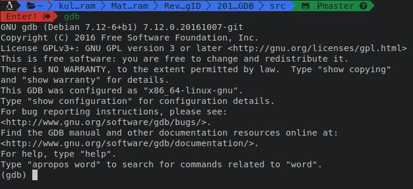

untuk permulaan, saya mempunyai simple program dengan bahasa c, yang kita jadikan sebagai program yang akan kita debug

seperti ini script sederhana kita,
``` c
#include <stdio.h>

int main(void)
{
    int a,b,c;
    a = 20;
    b = 20;
    c = a + b;
    printf("%d + %d = %d\n", a, b, c);
    return 0;
}
```
simpan dengan `namafile.c`,
compile dengan `gcc -g -o namafile namafile.c`
\*namafile bisa diganti apapun

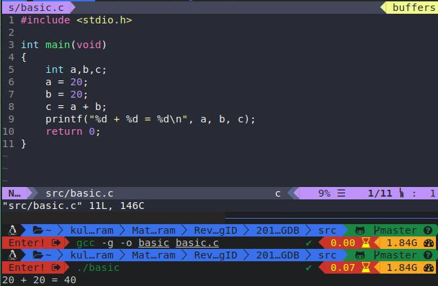

opsi -g pada gcc berfungsi untuk memberikan informasi debugging pada program

[[ File : basic ]](src/basic)

[[ File : basic.c ]](src/basic.c)

untuk yang males compile 😂 bisa langsung download binary dan sourcenya. dan juga supaya programnya sama dengan yang saya punya, mungkin beberapa versi compiler akan ngehasilin binary yang berbeda kalo dilihat di dari disassemblynya

load program basic diatas ke gdb, dengan perintah gdb ./basic

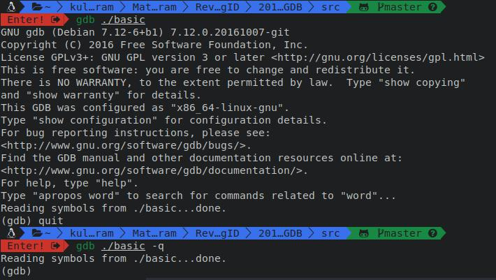

disini saya pakai perintah `gdb ./basic -q` supaya nggak nampilin output seperti perintah sebelumnya

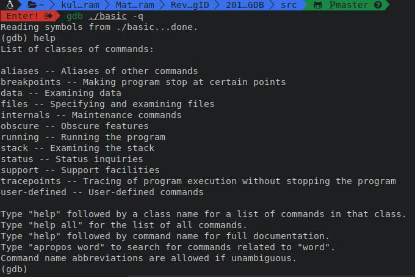

jika kalian ketik perintah help, maka akan banyak pilihan disana, gdb sangat terdokumentasi, jadi gak perlu takut hehe

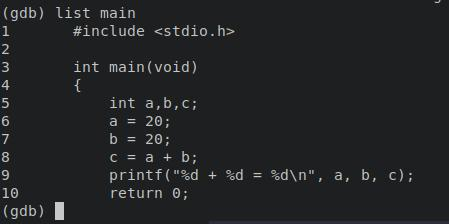

perintah `list main` akan menampilkan source code dari fungsi main, perintah ini akan bekerja kalo pada saat dicompile menambahkan opsi -g pada gccnya seperti yang dikatakan sebelumnya

dalam reverse engineering, mungkin binary tidak dicompile dengan opsi -g. jadi kita harus melihat disassemblynya. perintah `disassemble main` akan menampilkan hasil disassembly untuk fungsi main. perintah bisa disingkat menjadi `disas main`

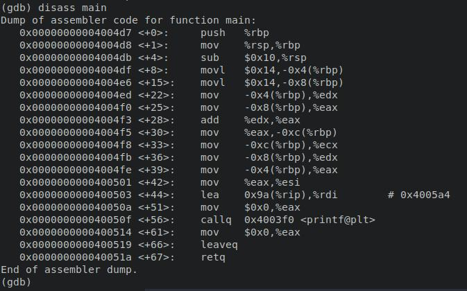

untuk yang belum pernah liat assembly, mungkin keliatannya aneh wkwkw

secara default, gdb akan menampilkan assembly dengan syntax AT&T (syntax assembly ada 2, syntax intel dan AT&T). untuk mengubahnya ke syntax intel bisa menggunakan perintah set disassembly-flavor intel. kalo saya terbiasa dengan syntax intel 

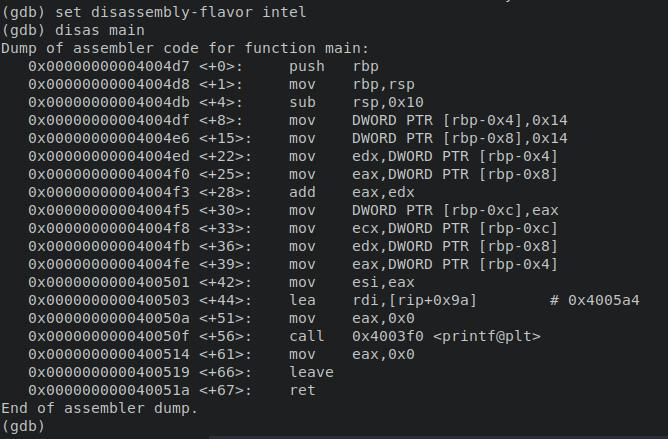

>untuk yang pengen lebih tau tentang assembly, bisa dicek disini http://www.ilmuhacking.com/programming/belajar-assembly-di-linux/ dan disini https://github.com/d4em0n/tutorial-assembly

untuk menjalankan program, gunakan perintah run bisa disingkat r aja

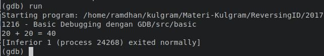

sekarang, kita akan mencoba breakpoint, breakpoint arti sederhanya yaitu mempause program

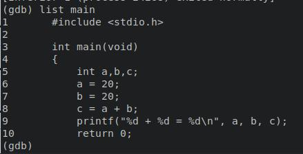

kita akan breakpoint pada baris 8, breakpoint di gdb menggunakan perintah `b nomor_baris` atau `b* alamat_intruksi`

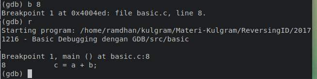

setelah perintah breakpoint, lalu kita jalankan dengan perintah `run` atau `r`

proses program yang berjalan akan berhenti dibaris 8, ketika break kita bisa melakukan apapun program, contohnya menampilkan variable dan mengeset variable

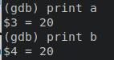

untuk mengubah nilai variable, kita bisa menggunakan perintah set

kita akan mengubah variable a menjadi 50

`(gdb) set variable a=50`

untuk melanjutkan proses, kita bisa menggunakan perintah continue atau c

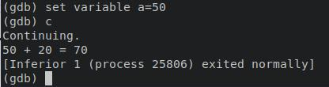

>variable a sudah berubah menjadi 50

contoh lain, masih dengan script yang sederhana

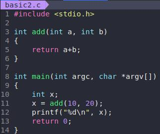

[[ File : basic2 ]](src/basic2)

[[ File : basic2.c ]](src/basic2.c)

cara compilenya masih sama dengan sebelumnya gcc -g -o namafile namafile.c

load programnya ke gdb. kita bisa melihat source code program seperti yang dipraktekan sebelumnya

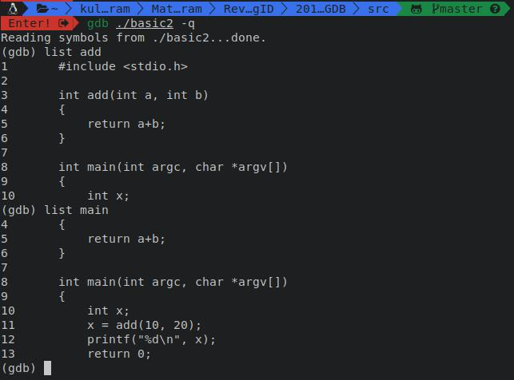

kita akan breakpoint sebelum fungsi add dipanggil. sebelumnya kita breakpoint dengan memasukkan nomor baris sebagai argumen. sekarang kita bisa melakukan breakpoint menggunakan alamat intruksi sebagai argumen, nantinya program akan berhenti pada alamat intruksi tersebut

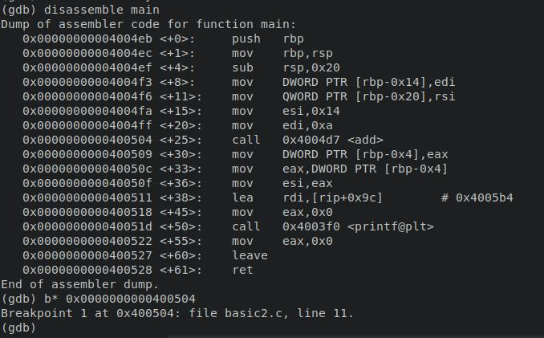

saya melakukan breakpoint pada alamat 0x0000000000400504, jika dilihat disana, itu merupakan tempat intruksi call, intruksi call diatas digunakan untuk memanggil fungsi add

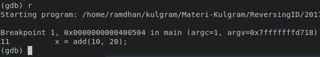

lalu kita jalankan

kalian perhatikan digambar ini, sebelum intruksi call, ada intruksi
```
mov esi, 0x14  -> artinya menyimpan nilai 0x14 (20 dalam desimal) ke register esi
mov edi, 0xa    -> artinya menyiimpan nilai 0xa (10 dalam desimal) ke register edi
```

ternyata itu adalah argumen yang digunakn untuk memanggil fungsi add, argumen pertama akan disiimpan di register edi, dan argumen ke 2 akan disimpan di register esi

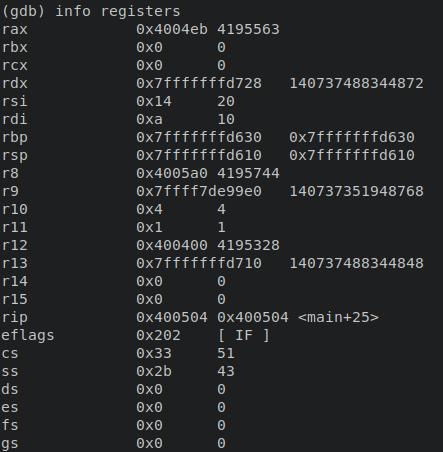

perintah `info registers` akan menampilkan semua register beserta nilainya, register rdi dan rsi berisi argumen pertama dan kedua untuk memanggil fungsi add

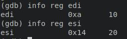

info registers bisa disingkat info reg atau i r dan bisa diikuti dengan nama register yang ingin ditampilkan

untuk mengganti nilai register, kita menggunakan perintah set seperti sebelumnya, tapi agak sedikit berbeda

contohnya, kita akan mengganti nilai edi (yang berisi argumen pertama) menjadi 31317

`(gdb) set $edi=31317`

lalu kita lanjutkan prosesnya dengan perintah continue atau c saja

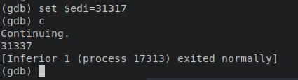

oke, mungkin itu saja yang bisa saya bagikan, selanjutnya kalian bisa cari referensi lainnya diinternet, salah satunya disini
https://betterexplained.com/articles/debugging-with-gdb/ dan disini
https://www.tutorialspoint.com/gnu_debugger/
masih jauh dan banyak yang harus dipelajari 😁, belajar bahasa C dan assembly akan sangat membantu untuk belajar reverse engineering. selebihnya bisa kalian tanyakan dan akan saya jawab semampunya. Terimakasih
